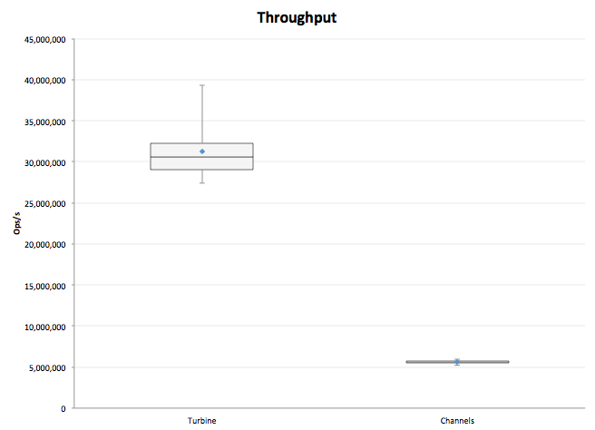
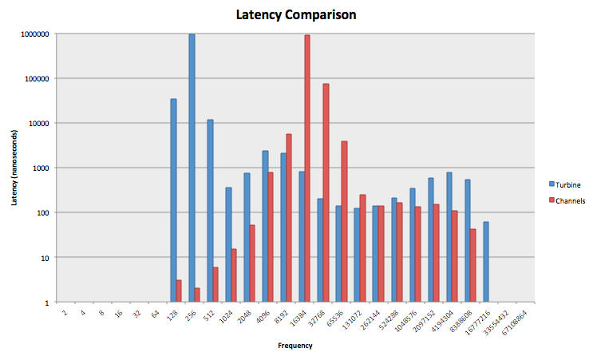
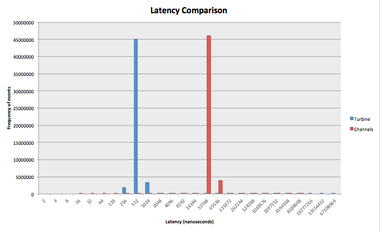

## Turbine

Turbine is a high-performance, non-locking, inter-task communication library written in Rust.

### Overview
Turbine is a spiritual port of the [LMAX-Disruptor pattern](https://github.com/LMAX-Exchange/disruptor).  Although the abstractions used in this library are different from those in the original Disruptor, they share similar concepts and operate on the same principle

Turbine is essentially a channel on steroids, permitting data passing and communication between tasks in a very efficient manner.  Turbine uses a variety of techniques -- such as non-locking ring buffer, single producer, consumer dependency management and batching -- to produce very low latencies and high throughput.

So why would you choose Turbine?  Turbine is excellent if it forms the core of your application.  Turbine, like Disruptor, is used if several consumers need act on the data in parallel, and then allow the "business" logic to execute.
Turbine is useful when you need to process millions of events per second.

On simple, synthetic tests, Turbine exceeds 30 million messages per second between tasks, while channels cap out around 4m (on the test hardware).

That said, Turbine does not replace channels for a variety of reasons.

- Channels are much simpler to use
- Channels are more efficient if you have low or inconsistent communication requirements
- Channels can be MPSC (multi-producer, single-consumer) while Turbine is SPMC
- Turbine requires significant memory overhead to initialize (the ring buffer)

### Documentation

[API docs can be found here.](http://polyfractal.github.io/Turbine/turbine/)

### Usage

```rust
// This struct will be the container for your data
struct TestSlot {
    pub value: int
}

// Your container must implement the Slot trait
impl Slot for TestSlot {
    fn new() -> TestSlot {
        TestSlot {
            value: 0
        }
    }
}

// Initialize a new Turbine
let mut turbine: Turbine<TestSlot> = Turbine::new(1024);

// Create an EventProcessorBulder
let ep_builder = match turbine.ep_new() {
    Ok(ep) => ep,
	Err(_) => fail!("Failed to create new EventProcessor!")
};

// Finalize and retrieve an EventProcessor
let event_processor = turbine.ep_finalize(ep_builder);

// Spawn a new thread, wait for data to arrive
spawn(proc() {
	event_processor.start::<BusyWait>(|data: &[TestSlot]| -> Result<(),()> {
	    // ... process work here ... //
	});
});

// Write data into Turbine
let mut x: TestSlot = Slot::new();
x.value = 19;
turbine.write(x);
```

### High-level Overview of Implementation

There are three moving parts in Turbine: the Turbine object, the event processors, and the ring buffer.

#### Main Turbine Object
The main turbine object is used to A) build the dependency graph between event processors, B) instantiate these event
processors and C) write data into the buffer.

The main object also maintains a list of "cursors" -- Atomic Longs that act as index positions into the ring buffer.
These cursors record the position of the writer and various event processors.  When an event processor is built,
it is given a copy of these cursors in an Arc<>.  This allows the event processors to update their position
as well as read the position of dependencies

The main object also owns the memory of the ring buffer, and has exclusive write access.  This means only a single
task is writing to the buffer and greatly simplifies the logic.

The cursors are maintained as U64s.  There is another (original) branch that tried to build Turbine with a small int
and handle ring buffer rollovers so that the library could operate for eternity without need for restart.  This proved
difficult.  So for now, monotonically u64s are being used as absolute indices.

The max value of a u64 is `18,446,744,073,709,551,615`.  If we assume that Turbine can write 1 billion messages a second
(for reference, it maxes out at 30m on my laptop) it would take 584.555 years before the u64 would overflow.  This is a
time-line I am willing to accept for now :)

#### Event Processors
Event processors receive borrowed slices of data from ring buffer, representing batches of work that they can consume.
These slices are borrowed and immutable, which means the EP can never invalidate or nullify data inside the ring buffer.
Once the EP is done processing, the slice is returned to the ring buffer when the closure drops.

Event processors can be daisy-chained in a dependency graph, which means that any particular EP will not receive a work
unit until all of its dependencies have already processed that piece of work.  The dependency chain may be arbitrarily
complex, as long as there are no cycles.

#### Ring Buffer
The ring buffer holds a pre-allocated vector of Slots, which the user defines as a custom container for application data.
The ring buffer is actually rather dumb: it only knows how to read and write into the datastructure.  It has no concept
of rollover, or even safe access patterns.  It relies entirely on external code to guarantee safe access to the underlying
data.

For this reason, many of the methods that it exposes are unsafe and are wrapped by the main object and the event processors.

### Performance
Turbine has not been tuned or optimized yet, and there are still a lot of ugly debug lines laying around.  That said, it's already pretty darn fast.

On my Macbook Air, Turbine sustains ~30m messages per second between threads (passing 100m integers between tasks).  In comparison, channels max out around 4-7m messages per second.



Perhaps more interesting is latency.  Below is a log-log plot of latency (in nanoseconds) for Turbine and channels.  Latency was measured by sending a single event and pausing for 10 microseconds, which helps assure that neither communication method is saturated with events.  The test was repeated for 100m iterations.



Turbine averages around 512ns per message, while channels average around 32,000ns (32 microseconds).  Because log-log plots are sometimes hard to interpret, here is a log-linear plot.  The x-axis is still logarithmic, but the frequency on the y-axis is linear:



As you can see, there is a rather large difference between the two.

There is definitely tuning left to be done.  The theoretical minimum latency on my test hardware is ~40ns, based on the latency of inter-core communication.  Which means the current performance is about 4x slower than it could be...plenty of tuning to do!

### Todo

- Switch from Rust-Empty to Cargo
- Performance tuning (in particular, cache invalidations)
- Remove the need to allocate a new Slot for each write (e.g. write should return a Slot which can be reused).
- Reuse existing slots in the buffer
- Investigate using an "abstract class" structure instead of closures (see [here for possible implementation](http://www.reddit.com/r/rust/comments/29ywdu/what_you_dont_love_about_rust/cipypom))
- More wait strategies
- Configurable writer wait strategy (hardcoded busy-wait right now)
- More tests.  In particular, multi-EP dependency graphs have not really been validated
- Multi-writer?
- Continue work on "wrap-around" counter instead of monotonic?